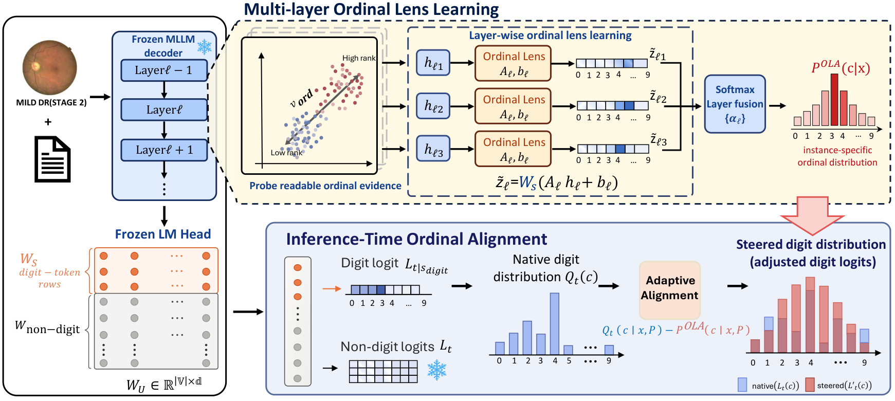

# OLA — Inference-Time Ordinal Lens Alignment

> Code release for *Latent Ordinal Evidence, Misaligned Outputs: Inference-Time Ordinal Lens Alignment for Multimodal LLMs*

## What OLA does

OLA is a **frozen-backbone, inference-time** procedure. The vision encoder, language-model backbone, unembedding `W_U`, and the digit-token row slice `W_S` are all frozen; the only learned parameters are lightweight per-layer lens weights and a `K`-dim fusion vector.



1. **`W_S`-anchored ordinal lens** (Eq. 4) — each of `K` mid-to-deep decoder layers maps its last-token hidden state to digit-token scores through the **frozen** `W_S`:

   `z_hat_l = W_S (A_l h_tilde_l + b_l)`,  `A_l = I + U_l V_l^T`,  `h_tilde_l = (h_l - mu_l) / sigma_l`

2. **Multi-layer fusion to `P^OLA`** (Eq. 6) — a learned softmax over layers:

   `a = softmax(alpha)`,  `z^OLA = sum_l a_l z_hat_l`,  `P^OLA = softmax(z^OLA)`

3. **Inference-time, digit-only logit correction** (Eq. 7) — applied to digit logits only; EOS and all non-digit logits are left untouched:

   `L'(c) = L_na(c) - lambda_star * omega(P^OLA) * (Q(c) - P^OLA(c))`,  `c in S_digit`

   where `Q = softmax(L_na[S_digit])`, `omega = max_c P^OLA(c)` is a confidence gate, and `lambda_star` is selected on the validation split.

`W_S` is verified by a SHA-256 hash before/after training so it provably never changes.

## Install

```bash
pip install -e .              # installs the `ola` package (torch + numpy)
pip install -e ".[hf]"        # + transformers, for real transformers.generate() integration
pip install -e ".[dev]"       # + pytest, to run the invariant tests
```

## Quickstart

```bash
python examples/quickstart_synthetic.py     # full pipeline on synthetic tensors, ~seconds
pytest -q                                    # method invariants (lambda=0 no-op, frozen W_S, sign, ...)
```

## Layout

```
ola/
  lens.py        # Eq.4 W_S-anchored lens, Eq.6 multi-layer fusion, frozen-W_S (SHA-256) checks
  train.py       # records, forward hooks, hidden-state cache, Stage A/B training, P^OLA cache, OLAConfig
  alignment.py   # tokenizer S_digit / S_eos ids, Eq.7 correction, lambda* search, online processor
  metrics.py     # accuracy, MAE, SRCC
examples/
  quickstart_synthetic.py   # end-to-end demo, no model download
tests/
  test_invariants.py        # fast correctness invariants
```
